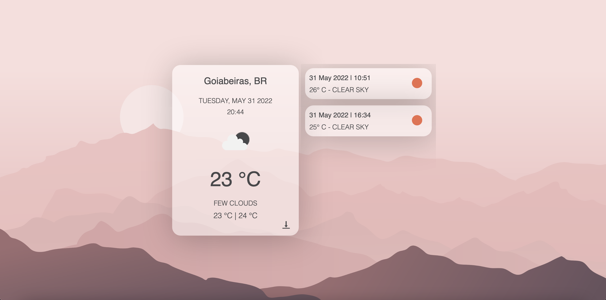

# The Weather Now

Página que mostra a temperatura e condições climáticas em tempo real com base na localização atual do usuário. 

Página desenvolvida em HTML, CSS e Javascript com o uso da API [OpenWeather](https://openweathermap.org/).

Código e design por Clarisse Moraes.

Imagem do background por [Vecteezy](https://www.vecteezy.com/free-vector/weather-background)